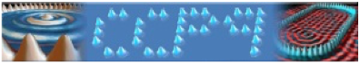

# Welcome to the Recent Appointees in Physical Chemistry 2026

**The latest edition of the Recent Appointees in Physical Chemistry organised by the RSC Faraday Council will be held at the University of Birmingham (UoB) from 07/09/2026 and 09/09/2026.**

# Schedule

### Day 1

| Timings     | Monday 07/09/26                    | Presenter                          | 
|-------------|------------------------------------|------------------------------------|
| 12:00-1:00  | Registration & Lunch               |                                    |
| 1:00-1:10   | Welcome                            |                                    |
| 1:10-3:30   | Networking Talks                   | Attendees                          |
| 3:30-3:40   | Sponsor Showcase - Bruker          | Rehan Shah & Laksha Parameswaran   |
| 3:40-4:00   | Coffee Break                       |                                    |
| 4:00-5:00   | Career, Life, and Building a Group | <a href="https://profiles.ucl.ac.uk/3176-helen-fielding">Prof. Helen Fielding </a>, University College London                  |
| 5:00-6:00   | Questions and Networking           | Attendees                          |

### Day 2

| Timings     | Tuesday 08/09/26                          | Presenter                                                                                                                |  
|-------------|-------------------------------------------|--------------------------------------------------------------------------------------------------------------------------|
| 9:30-10:00  |  Coffee & Networking                      |                                                                                                                          |
| 10:00-10:45 | Equity, Diversity, and Inclusion          | <a href="https://www.liverpool.ac.uk/people/xue-yong"> Dr Xue Yong </a>, University of Liverpool                         | 
| 10:45-12:00 |    Getting Started with Teaching          | <a href="https://www.birmingham.ac.uk/staff/profiles/chemistry/williams-dylan"> Dr Dylan Williams </a> (UoB)             | 
| 12:00-13:00 | Lunch                                     |                                                                                                                          | 
| 13.00-14.00 | Research Impact                           | <a href="https://www.linkedin.com/in/megan-chance-6ba95915b/"> Megan Chance </a>. UoB Research Impact Develpment Partner |
| 14:00-14:30 | Narrative CV                              | <a href="https://www.birmingham.ac.uk/staff/profiles/chemistry/cox-liam"> Prof. Liam Cox </a> (UoB)                      | 
| 14.30-15.00 | Building Research Strategy                | <a href="https://www.birmingham.ac.uk/staff/profiles/chemistry/scanlon-david"> Prof. David Scanlon </a> (UoB)            |
| 15:00-15:30 | Coffee                                    |                                                                                                                          | 
| 15:30-16:15 | Engaging with Industry                    | <a href="https://www.awe.co.uk/"> AWE Nuclear Security Technologies </a>                                                 |
| 16:15-17:00 | EPSRC Portfolio                           | Dr Uditt Sharma & Dr Samuel Alcorn, UKRI EPSRC                                                                           |
| 17:00-18:00 | Networking                                |                                                                                                                          |
| 19:30---    | Meeting Dinner & Drinks                   |  Mowgli's Restaurant, Birmingham Grand Central                                                                           | 

### Day 3

| Timings     | Wednesday 09/09/26                        | Presenter                                                                                                                | 
|-------------|-------------------------------------------|--------------------------------------------------------------------------------------------------------------------------|
| 9:30-10:00  | Coffee                                    |                                                                                                                          |  
| 10:00-11:00 | Behind the Scenes of Publishing           |  Ashley McGovern, Asst. Editor, Royal Society of Chemistry                                                               |  
| 11:00-13:00 | Leadership as an Academic                 |  Vincent O’Grady, UoB People and Organisation Development                                                                |  
| 13:00-14:00 | Lunch and Networking                      |                                                                                                                          |  
  
# Sponsors

We are grateful to the following sponsors for generous support of the event.

<table>
  <tr>
        <td></td>
  </tr>

  <tr>
        <td></td>
  </tr>

</table>

# Locations
<iframe src="https://www.google.com/maps/embed?pb=!1m18!1m12!1m3!1d2431.4928713377685!2d-1.9356864240392058!3d52.45210077204347!2m3!1f0!2f0!3f0!3m2!1i1024!2i768!4f13.1!3m3!1m2!1s0x4870bdd7c68704af%3A0xff032a2e9178b909!2sMolecular%20Sciences%20Building!5e0!3m2!1sen!2suk!4v1752160616045!5m2!1sen!2suk" width="600" height="450" style="border:0;" allowfullscreen="" loading="lazy" ></iframe>

The event will take at the Edgebaston Campus of the University of Birmingham. 

**All talks and networking events will take place in the Molecular Sciences Building.**

**The Conference Dinner** details will be communicated once available. 

Exhibitors will be found within the Molecular Sciences Building. 

# Accomodation
You will receive individual information on your accommodation with rooms reserved at: TBC
.

The hotel is located on the University of Birmingham Campus, and is a short <10 min walk away from the Molecualr Sciences Building. 

# Registration
The meeting is intended for individuals recently (last ~3 years) appointed to independent positions (including Fellowships) at a UK-based institution, in the broad area of physical chemistry. 

Interested colleagues should submit an expression of interest via the form here: <a href=" https://forms.office.com/e/edYwndEgfg
">Expression of Interest</a>

Note there is a nominal registration fee of £30 if offered a place, which will include lunch, coffee breaks, symposium dinner, and acommodation for non-local participants.

# Organising Team
For any questions please get in touch by email:

<table>
  <tr>
       <td> Dr Adam Michalchuk (University of Birmingham): a.a.l.michalchuk@bham.ac.uk </td>
  </tr>
  <tr>
      <td>  Dr Xue Yong (University of Liverpool): Xue.Yong@liverpool.ac.uk   </td>
  </tr>
  
  <tr>
      <td>  Dr Miguel Paez-Perez (Imperial College London): m.paez-perez16@imperial.ac.uk   </td>
  </tr>
</table>

